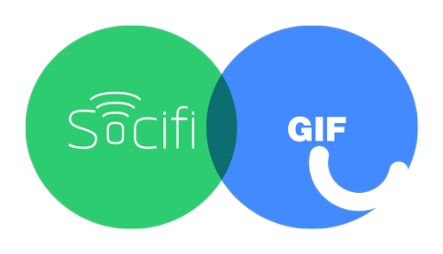

<p align="center">
     
</p>

# GIF Token contracts
_GIF by SOCIFI. Smart contracts for the `ERC-20` GIF Token and the crowdsale._

GIF represents the value of sponsorship (data/reward gifts) and the tool that
advertisers (sponsors) can use to obtain media space and/or SOCIFI products
and services, and which will be used to transform the reward to end-users
(subscribers) and peer to peer data gifting (one user can send a specific
amount of data to another as a gift).

Please see the official [website](https://gif.network/) to learn more about the
GIF Token, the ICO (crowdsale) and the whole ecosystem.

## Table of contents
* [Development](#development)
* [Contracts](/docs/Contracts.md)

## <a name="development"></a> Development

### Dependencies
GIF Token contracts require only local dependencies to be installed.
No need to install anything globally.
```bash
$ npm install
```

### Testing
```bash
$ npm test
```

### Code coverage
```bash
$ npm run coverage
```
#### Running on Windows
Running code coverage require to start instance of TestRPC SC. This is done
automatically by Solidity coverage. However, this is not possible on Windows.

##### Recommended: Using Bash
Modern versions of Windows allows you to install a linux. This gives you the
Linux bash (e.g. "Bash on Ubuntu on Windows") where the code coverage command
works great.

##### Running testrpc-sc on its own
Please consult official guide: [Running on windows](https://github.com/sc-forks/solidity-coverage/blob/master/docs/faq.md#running-on-windows)

### Linting
```bash
$ npm run lint
```
